# C4 Component — внутреннее устройство ядра системы

```markdown
# C4 Component Diagram — Orchestrator Core

```mermaid
flowchart LR
    SQ[SanitizeQueryNode]
    DR[DetectDateRangeNode]
    GQ[GenerateQueryNode]
    VQ[ValidateQueryNode]
    EQ[ExecuteQueryNode]
    CE[CheckErrorNode]
    FQ[FixQueryNode]
    AD[AnonymizeDataNode]
    AN[AnalyzeDataNode]
    FR[FormatResultNode]
    
    SQ --> DR
    DR --> GQ
    GQ --> VQ
    VQ -->|Valid| EQ
    VQ -->|Invalid| GQ
    EQ --> CE
    CE -->|Success| AD
    CE -->|Error| FQ
    FQ -->|Retry < 5| GQ
    FQ -->|Max attempts| ERR[ErrorState]
    AD --> AN
    AN --> FR
    FR --> END[Return Response]
    
    subgraph State [AgentState<br>TypedDict]
        direction TB
        S1[user_query]
        S2[generated_query]
        S3[execution_result]
        S4[fix_attempts]
        S5[success]
    end
    
    SQ -.-> State
    EQ -.-> State
    FQ -.-> State
    FR -.-> State
    
    classDef node fill:#e3f2fd,stroke:#1976d2
    classDef state fill:#fff3e0,stroke:#ff9800
    
    class SQ,DR,GQ,VQ,EQ,CE,FQ,AD,AN,FR,ERR node
    class State state
```



### Ключевые моменты:
* Граф состояний с явными переходами и условиями (валидация, ошибки, лимит попыток)
* Общий AgentState (TypedDict) доступен всем нодам для координации
* Цикл исправления ошибок: CheckError → FixQuery → GenerateQuery (до 5 раз)
* Линейный поток успеха: от санитизации до форматирования результата