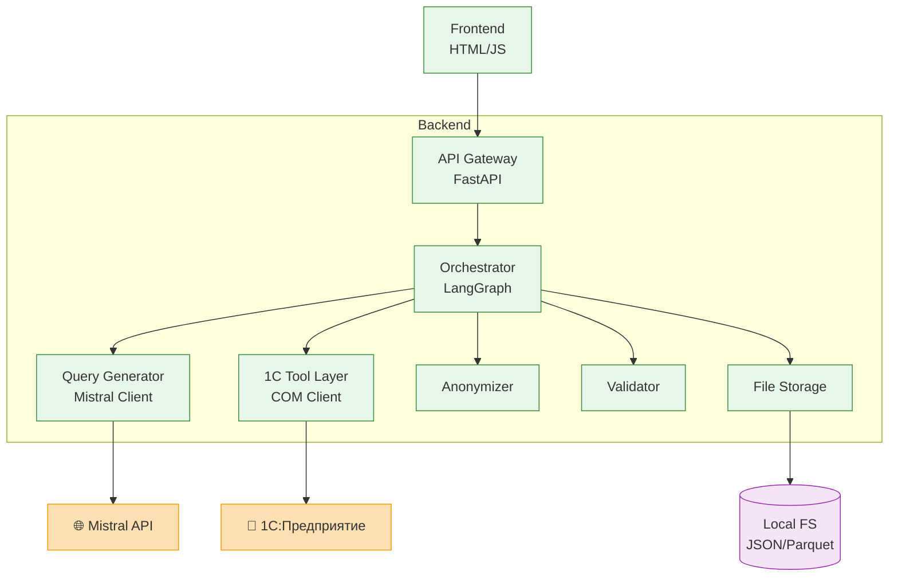

# C4 Container — frontend/backend, orchestrator, retriever, tool layer, storage, observability

### Ключевые моменты:
* Оркестратор (LangGraph) координирует все сервисы через явные ноды
* Два внешних клиента: LLM для генерации, COM для выполнения
* Три критических сервиса безопасности: анонимизатор, валидатор, хранилище
* Локальное хранилище с разделением на сырые и анонимизированные данные