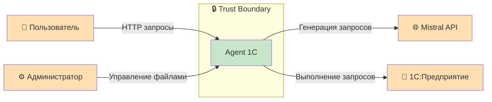

# C4 Context — система, пользователь, внешние сервисы и границы

### Ключевые моменты:
* Два типа пользователей: обычные (менеджеры, аналитики) и администраторы (управление файлами)
* Две внешние зависимости: 1С (локально) и Mistral API (облако)
* Все операции с ПнД происходят внутри доверенной границы