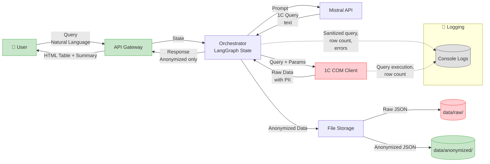

# Data Flow Diagram — Agent 1C

**Описание:** Как данные проходят через систему, что хранится, что логируется

### Ключевые моменты:
* Сырые ПнД никогда не покидают доверенную зону (1С → data/raw/ → анонимизация)
* Логирование содержит только санитизированные данные и метрики (количество строк, ошибки)
* Два уровня хранения: raw/ (админ, 30 дней) и anonymized/ (все пользователи)
* Внешние сервисы (Mistral) получают только санитизированные запросы без ПнД