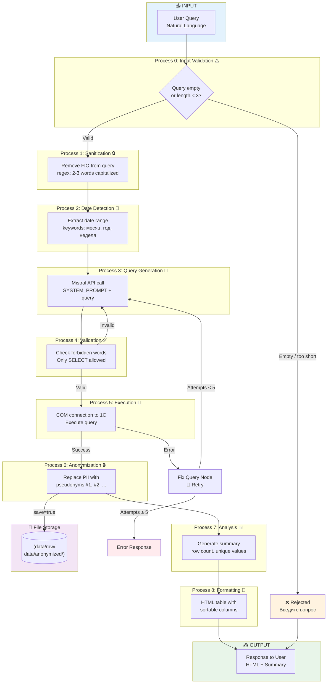

# Workflow Diagram — Agent 1C

**Описание:** Workflow — пошаговое выполнение запроса, включая ветки ошибок

### Ключевые моменты:
* **Валидация ввода (Process 0):** пустые запросы и строки < 3 символов отклоняются немедленно, без вызова LLM/COM
* Двухуровневая защита ПнД: санитизация входа + анонимизация выхода
* Автоисправление ошибок с лимитом 5 попыток для защиты от бесконечных циклов
* Опциональное сохранение: сырые данные (только админ) + анонимизированные (все пользователи)